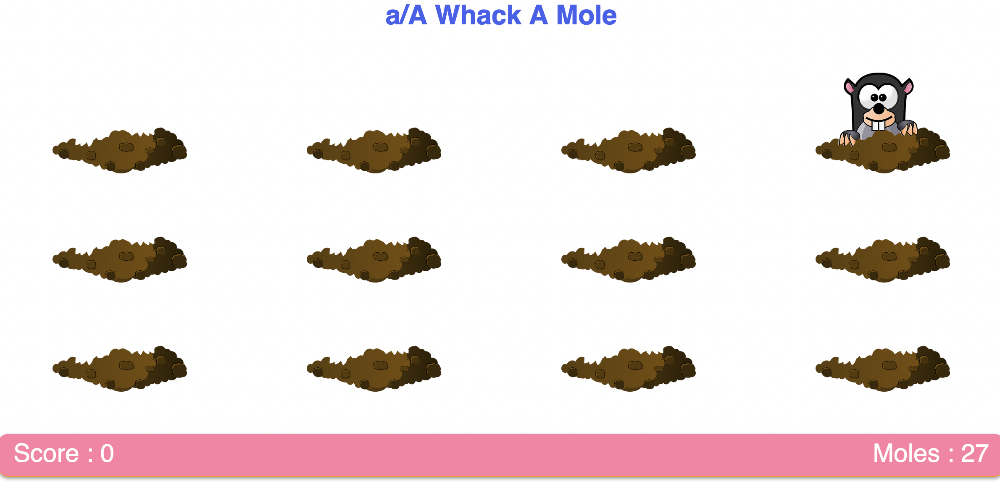
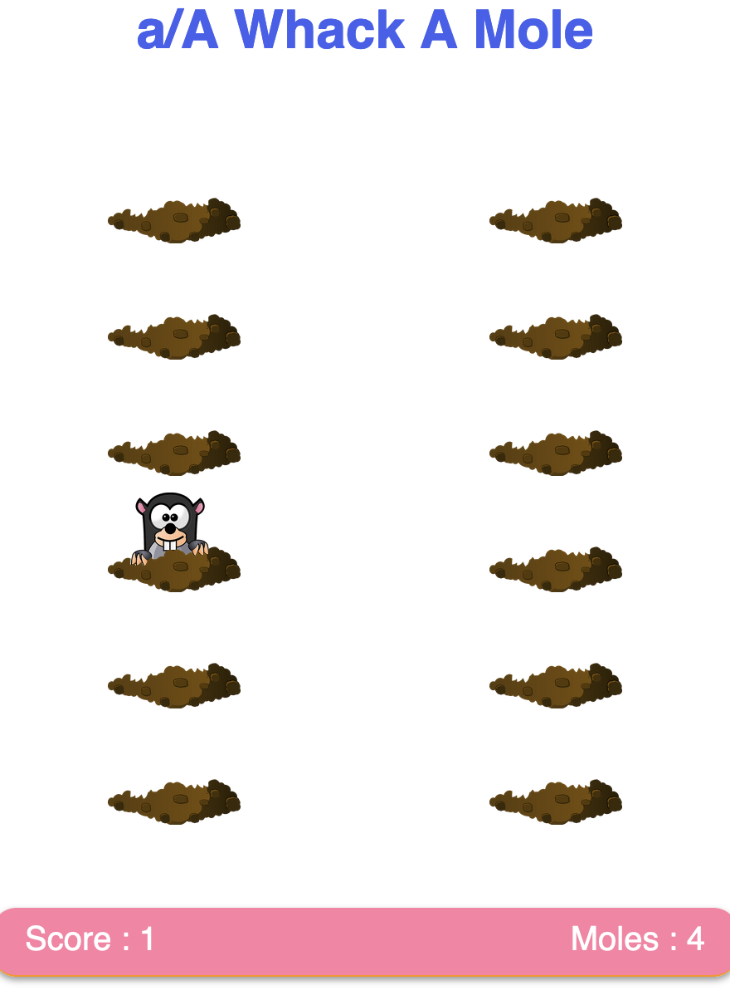

# a/A Open Project: CSS Whack-A-Mole

[app Academy](https://www.appacademy.io/) is a San Francisco-based software engineering bootcamp that offers courses both online and on campus. This repository contains my personal solution to "CSS Whack-A-Mole" as part of [a/A Open](https://www.appacademy.io/course/app-academy-open), the free version of a/A's entire online full-stack curriculum. 

 

## Live Site Demo

-Not setup yet. 

## Objective

The objective was to use CSS positioning, hover effects, transitions and overflow to create a a Whack-A-Mole game with provided images.  

## Implementation Highlights

### Make it responsive

 - So that all the moles can be seen and the game can still be played on smaller screens.
 - To practice using CSS grid and media queries.

<!--   { width: 320px } -->
 

### Expanded playing field

- To make use of the entire screen and for some added challenge.

 

### Animated 'whacked' moles

https://user-images.githubusercontent.com/80650207/193791431-e8261479-2ead-4460-aa45-0f107a1a45e2.mov

## User Stories

-Not setup yet.

< /  > by [@zowdk](https://twitter.com/zowdk)

